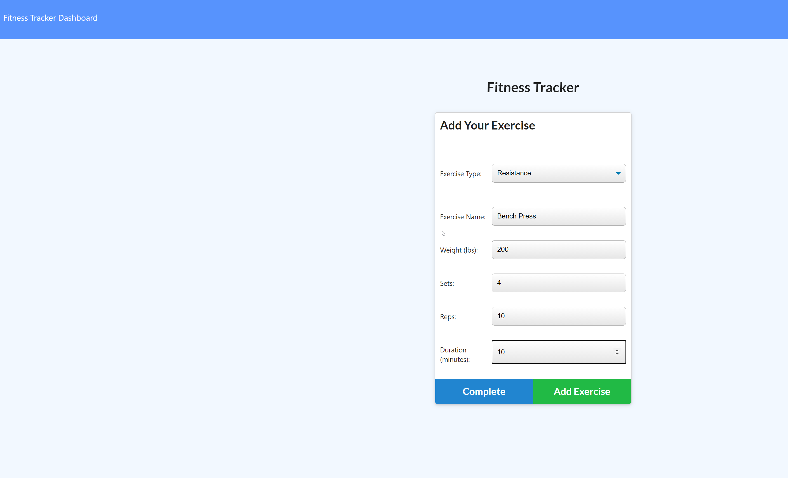
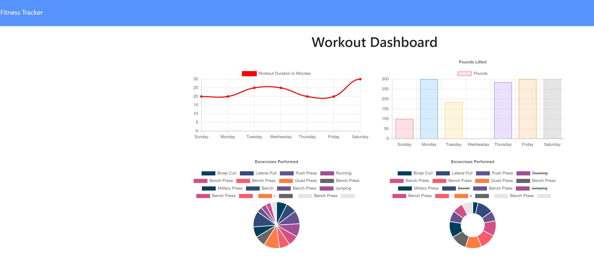

# Fitness Tracker

 ## Description 
  This is a sample and fun Fitness Tracker app that allows the user to track exercises on a daily basis and a graph showing progress. This full-stack app that uses HTML, CSS, JavaScript, Express, and MongoDb/Mongoose.

  ## Table of Contents
  [1.  Installation](##Installation) 

  [2.  Instructions](##Instructions)

  [3.  App](##App)
  
  [4.  Questions](##Questions)

## Installation
  This needs requires the use of the following packages:

  [Express](https://www.npmjs.com/package/express)

  [Mongoose](https://www.npmjs.com/package/mongoose)

## Instructions

  1.    Make sure node.js is installed.
  2.    Run npm init.  This will install the packages in the package.json file (Express, Mongoose, and Morgan)
  3.    In the Develop folder, run a seeder file `npm run seed.`  This should insert 10 rows.
  4.    Run node server and then open a browser to create/add an exercise or view the Tracker and its graph showing your progress.

## App 

  
  

## Questions

  [Github Repository](https://github.com/kurt-austin/fitnessTracker)

  [Heroku Repository](https://git.heroku.com/lit-cove-49302.git)

  [Fitness Tracker Deployed App](https://lit-cove-49302.herokuapp.com/)

  [Contact](kurt.austin@gmail.com)
